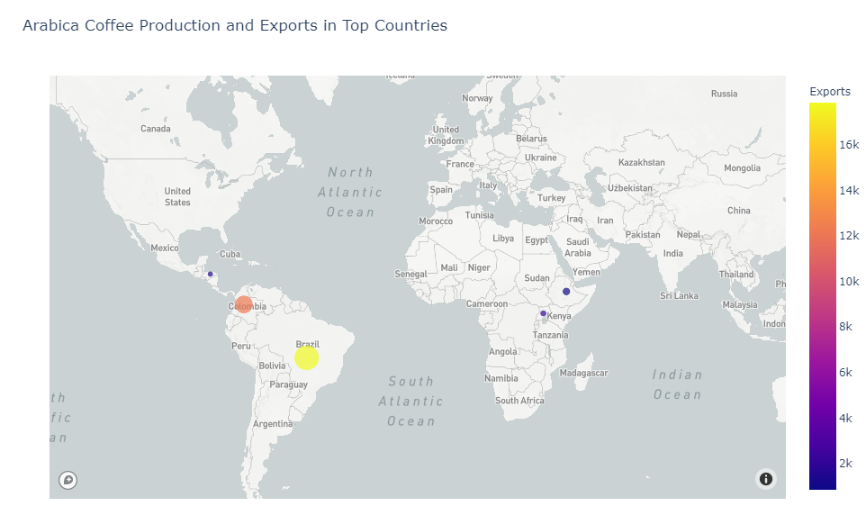

# The Coffee Value Chain: Commodity and FX Volatility in Emerging Markets

*Do FX and commodity price volatility affect coffee production, exports, and revenues?*

>**hypothesis:** higher FX and commodity price volatility are negatively correlated to production, exports, and revenues.

For this project, we will use data in order to analyze this in the five largest Arabica-growing countries over time:
1. Brazil
2. Colombia
3. Ethiopia
4. Uganda
5. Honduras

## Data: Sources and Exploration
____

### Sources
**[ICO](http://www.ico.org/) (International Coffee Organization):** main intergovernmental organization for coffee, bringing together exporting and importing Governments to tackle the challenges facing the world coffee sector through international cooperation

**[UN ComTrade](https://comtrade.un.org/) (United Nations Comtrade Database):** repository of official international trade statistics and tables all data available through _API_

**[ICE Coffee Futures](https://www.theice.com/products/15/Coffee-C-Futures) :** the world benchmark for Arabica coffe

**[IMF](https://www.imf.org/external/index.htm) International Monetary Fund):** system of exchange rates and international payments that enables countries (and their citizens) to transact with each other
Foreign Exchange Rates

**[World Bank](https://www.worldbank.org/) :** unique global partnership: five institutions working for sustainable solutions that reduce poverty and build shared prosperity in developing countries.
Interest rates

**Fun Fact:** The International Coffee Council is the highest authority of the ICO, headquartered in London and current executive director is the Brazilian José Sette). It's composed of representatives of each Member Government. It meets in March and September to discuss *coffee matters* - Wikipedia

### Clean Up and Exploration (do not try this at home)

- Transposing and locating columns & rows
- Specify dtype
- Removing nulls
- Date Formatting
- Split() 
- Conditionally slicing data
- Statistics
- Concatenation

## Data Analysis
____
### Map

### Currency vs. Exports

### FX Volatility vs. Exports

### Coffee Futures Volatility and Production

### Heat Map

## To Discuss
____
- FX rate weakness is positively correlated with exports, where local currency is weaker against the dollar as a benchmark. 

- KC (coffee futures) volatility is negatively correlated with production levels. 

- What the data showed or did not show: data validated our initial hypotheses, with some exceptions and caveats.

# Conclusions
____
- Market price and FX volatility is generally intimately correlated to commodity production levels and exports... However, this relationship can be altered by consumer attitudes and choices.

- Different actors/markets/countries react and adapt differently to volatility.

Postmorterm not shown in this README.md file. Please attend presentation.

| Project by |
|-----------:|
| Gregory Terrinoni |
| Daniel Singer |
| Benjamin Cifuentes |
| Andrea Asbun |
